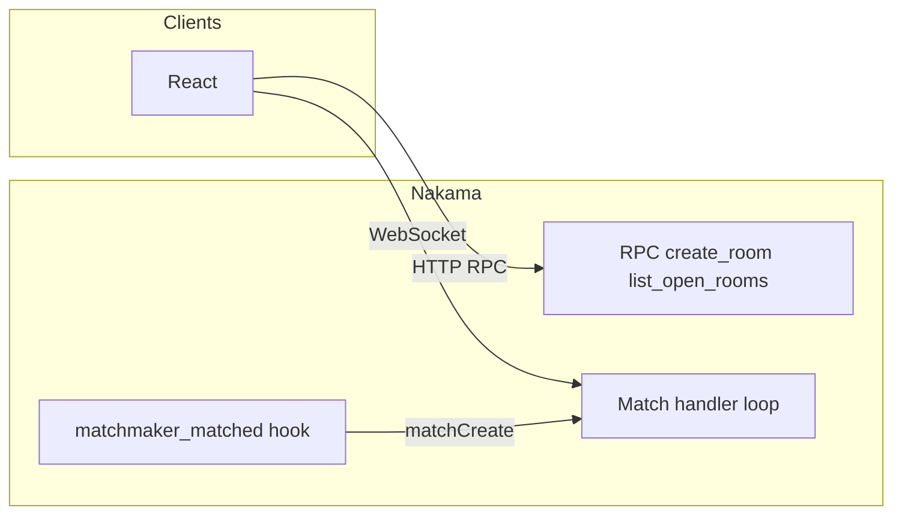

# Multiplayer Tic-Tac-Toe (Nakama)

Production-oriented sample: **server-authoritative** Tic-Tac-Toe on [Nakama](https://heroiclabs.com/docs/nakama/concepts/introduction/), **React + Vite** client, **Docker Compose** for Postgres + Nakama, optional **leaderboard** and **30s/move** timed mode.

## Architecture

- **Authoritative match** (`tictactoe_auth`): all board state and rules live in the Nakama TypeScript runtime module. Clients send **move intents** only (`opcode 1`, payload `{ "c": 0..8 }`). The server validates turn, cell, and phase, updates state, detects win/draw/timeout, then broadcasts a **state snapshot** (`opcode 2`) to every presence in the match.
- **Isolation**: each `match_id` is an independent match instance. Open rooms are discovered via `nk.matchList` (exactly one seated player waiting for a second).
- **Matchmaking**: clients call `socket.addMatchmaker` with query `+properties.mode:tictactoe`. `registerMatchmakerMatched` creates an authoritative match with `nk.matchCreate` and returns its id so both players join the same instance.
- **Disconnects**: seats are kept; presences are nulled on leave. Rejoin is allowed for the same `user_id`. After **120s** disconnected during `playing`, the active player wins by forfeit. **Timed** matches use a **30s** per-move deadline on the server clock.
- **Leaderboard**: on a decisive win (not draw), `leaderboardRecordWrite` increments the winner’s score on leaderboard `tic_tac_toe_wins`. RPC `leaderboard_top` returns top records.



## Repository layout

| Path | Purpose |
|------|---------|
| [docker-compose.yml](docker-compose.yml) | Postgres 16 + Nakama 3.24, mounts [nakama/modules/](nakama/modules/) |
| [nakama/src/](nakama/src/) | TypeScript runtime: match handler, RPCs, game logic |
| [nakama/modules/index.js](nakama/modules/index.js) | Built bundle (`npm run build` in `nakama/`) |
| [frontend/](frontend/) | Vite + React UI |
| [nakama/Dockerfile](nakama/Dockerfile) | Optional image baking `modules/*.js` for cloud |

## Prerequisites

- **Node.js** 20+ (for building Nakama module + frontend)
- **Docker Desktop** (or compatible engine) for local Nakama + Postgres

### Docker CLI error on Windows (`dockerDesktopLinuxEngine` / “pipe … not found”)

That means **Docker Engine is not running**. Start **Docker Desktop** and wait until it says it is running, then retry `docker compose up -d` or `docker compose restart nakama`. WSL2 integration must be enabled if Docker asks for it.

## Local setup

1. **Build the Nakama module** (generates `nakama/modules/index.js`):

   ```bash
   cd nakama
   npm install
   npm run build
   ```

2. **Start databases and Nakama** from the repo root:

   ```bash
   docker compose up -d
   ```

   - API / WebSocket: `http://localhost:7350` (WS same host/port; use `wss` only behind TLS).
   - Default **server key** in compose: `defaultkey` (change for any shared environment).
   - **[nakama/nakama-dev.yml](nakama/nakama-dev.yml)** adds **CORS** headers for setups that call Nakama directly from the browser (e.g. `VITE_NAKAMA_USE_VITE_PROXY=false`). Default dev flow uses the **Vite proxy** instead, so CORS is not required on `5173`.

3. **Frontend env**: copy [frontend/.env.example](frontend/.env.example) to `frontend/.env` and adjust if needed.

4. **Run the web app**:

   ```bash
   cd frontend
   npm install
   npm run dev
   ```

   Open the URL Vite prints (usually `http://localhost:5173`).

   **Dev proxy:** In development, the UI talks to Nakama **through Vite** (`/v2` and `/ws` on port 5173 are proxied to `http://127.0.0.1:7350`). You do not need CORS in the browser for that setup. Production / `vite preview` still uses `VITE_NAKAMA_HOST` / `VITE_NAKAMA_PORT` (or set `VITE_NAKAMA_USE_VITE_PROXY=false` in dev to call Nakama directly).

5. **Verify Nakama** (optional, PowerShell from repo root):

   ```powershell
   .\scripts\check-nakama.ps1
   ```

   If that fails, the UI will stay disconnected until Docker is running and `docker compose up -d` has finished starting Postgres + Nakama. Use **Retry connection** in the lobby after fixing Docker.

### If you see `HTTP 500` from the lobby

1. **Reload the runtime module** after code changes: from the repo root run `cd nakama && npm run build`, then `docker compose restart nakama`.
2. Inspect the server: `docker compose logs nakama --tail 100` (look for Go/panic lines or `list_open_rooms` / `leaderboard` errors).
3. The server module was hardened so `list_open_rooms` and `leaderboard_top` no longer crash the RPC path if `matchList` / leaderboard APIs return an unexpected shape; leaderboard creation now uses valid sort/operator enums.

## Match message protocol

| Opcode | Name | Direction | Payload |
|--------|------|-----------|---------|
| `1` | Move intent | Client → Server | JSON `{"c": number}` cell index 0–8 |
| `2` | State snapshot | Server → Clients | JSON see below |
| `3` | Error | Server → sender | JSON `{"code": string, "detail"?: string}` |

**State snapshot** (authoritative):

- `board`: nine cells `0` empty, `1` X (seat 0), `2` O (seat 1)
- `phase`: `waiting` | `playing` | `finished`
- `current_turn_seat`: `0` or `1` while playing
- `seat_user_ids`: `[seat0UserId, seat1UserId]`
- `winner_seat`, `draw`, `timed`, `move_deadline_ms` (epoch ms when timed)
- `room_code`: four-digit string for private rooms created via `create_room`, else `null`
- `vs_bot`: `true` when the opponent is the built-in minimax bot (`create_bot_room`)

## RPC API (authenticated)

All RPCs require a valid session (device auth in the demo).

| ID | Request body (JSON) | Response payload (object) |
|----|---------------------|----------------------------|
| `create_bot_room` | `{ "timed"?: boolean }` | `{ "match_id": string, "timed": boolean, "vs_bot": true }` (solo vs built-in bot; not listed in open rooms) |
| `create_room` | `{ "timed"?: boolean }` | `{ "match_id": string, "room_code": string, "timed": boolean }` (4-digit code for friends to join) |
| `list_open_rooms` | `{ "limit"?: number }` | `{ "rooms": [{ "match_id", "size", "label", "room_code"?: string }] }` |
| `room_by_code` | `{ "code": string }` (exactly 4 digits) | `{ "match_id": string, "room_code": string }` or `{ "error": string, "detail"?: string }` |
| `leaderboard_top` | `{ "limit"?: number }` | `{ "records": [...], "next_cursor"?: string }` |

**Example** (after you have a session JWT from the client or Nakama console):

```bash
# Replace SESSION with a Bearer token from authenticate device
curl -s "http://127.0.0.1:7350/v2/rpc/create_room" \
  -H "Authorization: Bearer SESSION" \
  -H "Content-Type: application/json" \
  -d "{\"timed\":false}"
```

The HTTP API returns a JSON envelope; the `@heroiclabs/nakama-js` client unwraps `payload` into an object for you.

## Matchmaking (client)

- Query: `+properties.mode:tictactoe`
- String properties: `{ "mode": "tictactoe", "timed": "0" | "1" }`
- `minCount` / `maxCount`: `2` / `2`

On `matchmaker_matched`, join with `socket.joinMatch(undefined, token)`.

## Multiplayer testing

1. Start Docker stack and `npm run dev` for the frontend (two windows or two browsers).
2. **Room flow**: Player A → **Create room** → copy or share `match_id` from the UI (or from RPC). Player B → **Join** that id or use **Open rooms → Join**.
3. **Auto match**: both click **Find match** with the same timed/classic preference; they should land in the same match.
4. **Cheating / invalid**: try clicking out of turn or an occupied cell; you should see an error toast and the board unchanged.
5. **Disconnect**: mid-game close a tab; within the forfeit window, reconnect by joining the same `match_id` again with the same device profile (same stored session/device id).

## Deployment

### Backend (example: VPS + Docker)

1. Point a DNS name at the server; terminate TLS (e.g. **Caddy** or **nginx**) on `443` and reverse-proxy to Nakama `7350` / `7351` or expose Nakama behind the proxy path per [Nakama deployment docs](https://heroiclabs.com/docs/nakama/getting-started/install/docker/).
2. Use a strong Postgres password and Nakama `socket.server_key` / `session` settings; restrict firewall to `443` (and SSH).
3. Build the module in CI or on the host (`cd nakama && npm ci && npm run build`), then either:
   - Volume-mount `nakama/modules` like local compose, or
   - `docker build -f nakama/Dockerfile nakama` after copying built `index.js` into the build context.

Set the frontend env to your public host and `VITE_NAKAMA_USE_SSL=true` when serving the API over HTTPS.

### Frontend (Vercel / Netlify)

- Root directory: `frontend`
- Build: `npm run build`
- Output: `dist`
- Environment variables: same as `frontend/.env.example` but with your **public** Nakama hostname and `VITE_NAKAMA_USE_SSL=true` when applicable.

**Security note:** browsers cannot keep Nakama’s master secret private. For real production, use a **dedicated client/server key** configured for your game, rate limits, and ideally a thin backend for sensitive operations. This repo follows the usual **demo** pattern (`defaultkey` locally).

## Live URLs

After you deploy, add here:

- **Game (frontend):** `https://…`
- **Nakama API base:** `https://…:7350` (or your reverse-proxy URL)

## License

Apache-2.0 (Nakama sample style; adjust if your employer requires a different header).
